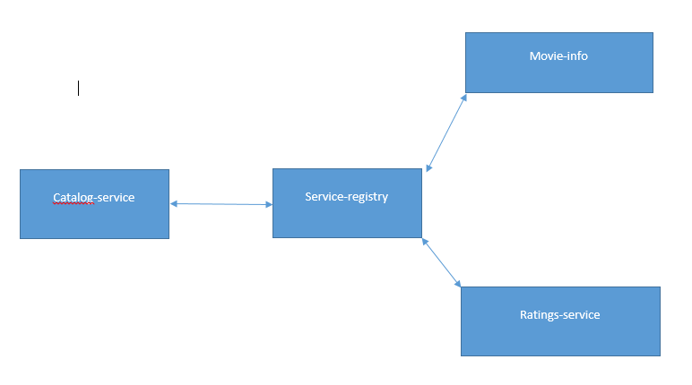
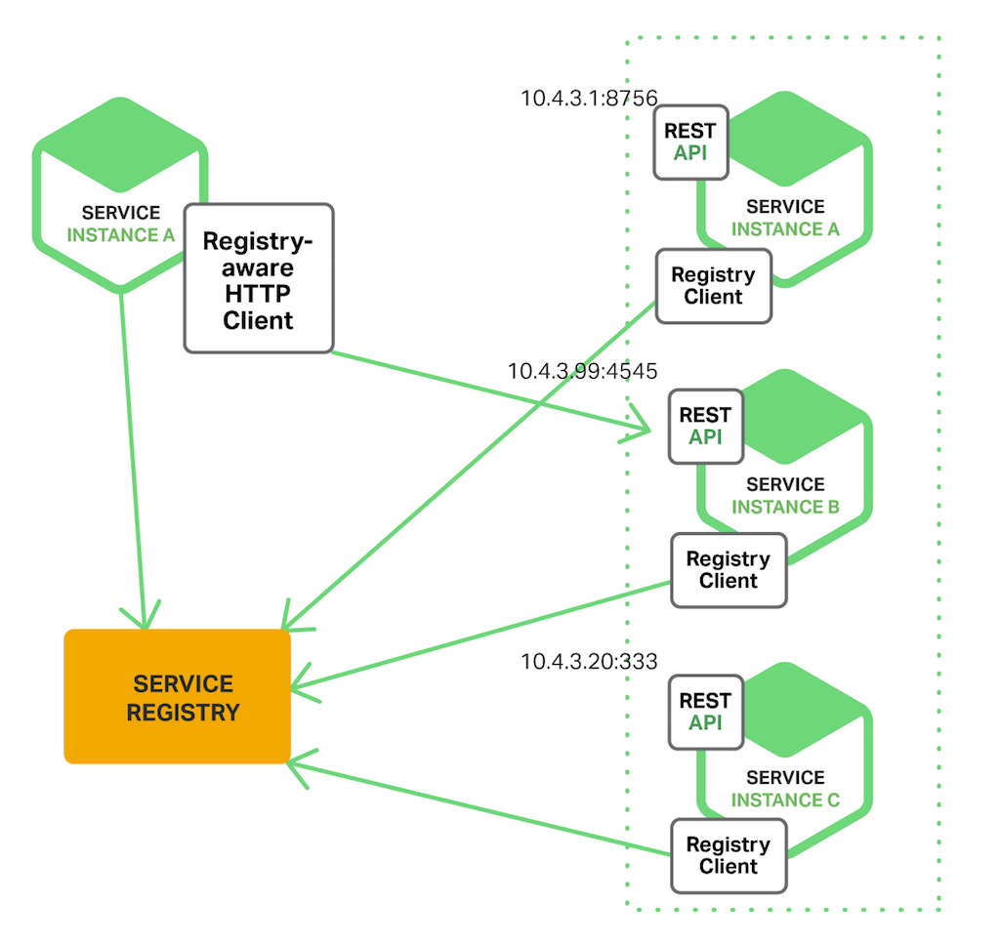

# Overview of the project
Application deals with movies and ratings. There are three microservices
1. catalog-service : Provides the list of movies that a user have watched and rated
2. movie-info: Provides the details about the movie-info
3. ratings service: Details about the rating that the user provided for the movies he/she watched.
4. Discover-service: acts like the service registery. Here we are using eureka server for service discovery. Here we are using client registery pattern, where each client will register 
to the eureka server. Eureka server provides service discovery, load balancing, fault taulerance and caching.

# WHY Service discovery
1. Dynamic IP address
2. Autoscaling
3. Failure in services
4. upgrades

# Client side discovery pattern
When using client‑side discovery, the client is responsible for determining the network locations of available service instances and load balancing requests across them. The client queries a service registry, which is a database of available service instances. The client then uses a load‑balancing algorithm to select one of the available service instances and makes a request.

## befnefit
* it can make intelligent, application‑specific load‑balancing decisions such as using hashing consistently.
## drawback
* it couples the client with the service registry. You must implement client‑side service discovery logic for each programming language and framework used by your service clients.

# References:
1. [Intro to microservice architecture](https://dzone.com/articles/what-is-microservices-an-introduction-to-microserv)
2. [Build microservice using spring boot](https://www.youtube.com/watch?v=y8IQb4ofjDo&list=PLqq-6Pq4lTTZSKAFG6aCDVDP86Qx4lNas&index=1)